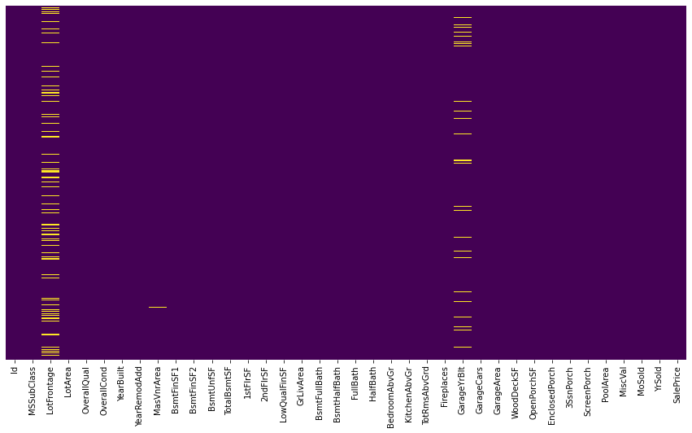
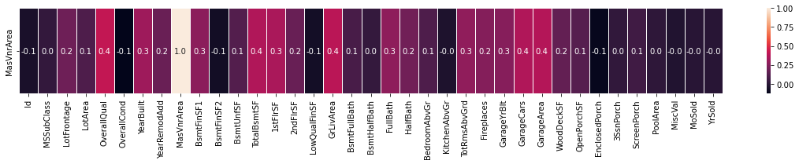
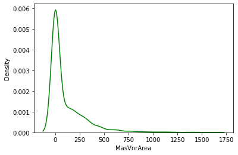
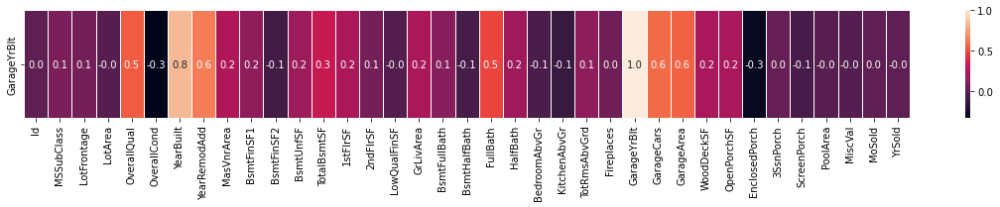
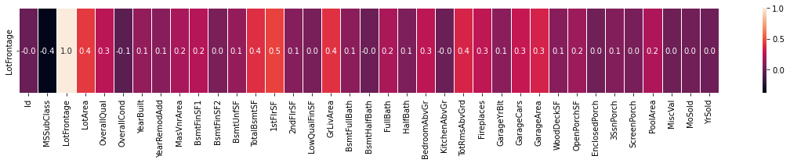
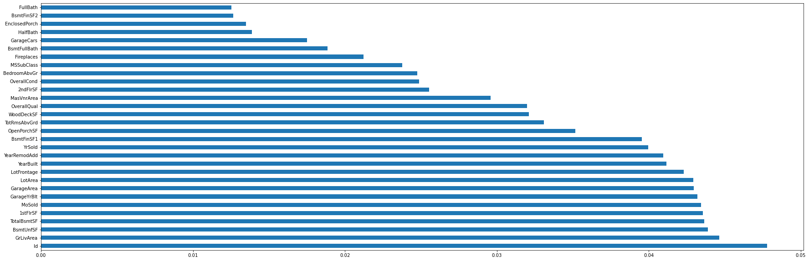
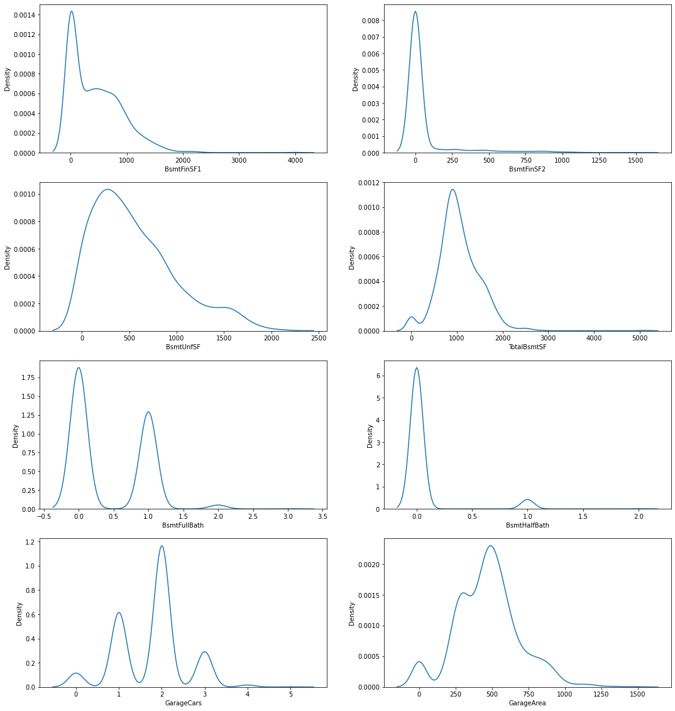

# House_Prices

```python
import numpy as np
import pandas as pd
import seaborn as sns
import matplotlib.pyplot as plt
```


```python
train = pd.read_csv('homedata/train.csv')
test = pd.read_csv('homedata/test.csv')

```


```python
print(train.shape)
print(test.shape)
```

    (1460, 81)
    (1459, 80)


```python
print(train.dtypes.unique())
```

    [dtype('int64') dtype('O') dtype('float64')]


```python
num_col = train.select_dtypes(exclude='object')
cat_col = train.select_dtypes(exclude=['int64', 'float64'])

num_col.describe(include='all')
```


<div>
<style scoped>
    .dataframe tbody tr th:only-of-type {
        vertical-align: middle;
    }

    .dataframe tbody tr th {
        vertical-align: top;
    }

    .dataframe thead th {
        text-align: right;
    }
</style>
<table border="1" class="dataframe">
  <thead>
    <tr style="text-align: right;">
      <th></th>
      <th>Id</th>
      <th>MSSubClass</th>
      <th>LotFrontage</th>
      <th>LotArea</th>
      <th>OverallQual</th>
      <th>OverallCond</th>
      <th>YearBuilt</th>
      <th>YearRemodAdd</th>
      <th>MasVnrArea</th>
      <th>BsmtFinSF1</th>
      <th>...</th>
      <th>WoodDeckSF</th>
      <th>OpenPorchSF</th>
      <th>EnclosedPorch</th>
      <th>3SsnPorch</th>
      <th>ScreenPorch</th>
      <th>PoolArea</th>
      <th>MiscVal</th>
      <th>MoSold</th>
      <th>YrSold</th>
      <th>SalePrice</th>
    </tr>
  </thead>
  <tbody>
    <tr>
      <th>count</th>
      <td>1460.000000</td>
      <td>1460.000000</td>
      <td>1201.000000</td>
      <td>1460.000000</td>
      <td>1460.000000</td>
      <td>1460.000000</td>
      <td>1460.000000</td>
      <td>1460.000000</td>
      <td>1452.000000</td>
      <td>1460.000000</td>
      <td>...</td>
      <td>1460.000000</td>
      <td>1460.000000</td>
      <td>1460.000000</td>
      <td>1460.000000</td>
      <td>1460.000000</td>
      <td>1460.000000</td>
      <td>1460.000000</td>
      <td>1460.000000</td>
      <td>1460.000000</td>
      <td>1460.000000</td>
    </tr>
    <tr>
      <th>mean</th>
      <td>730.500000</td>
      <td>56.897260</td>
      <td>70.049958</td>
      <td>10516.828082</td>
      <td>6.099315</td>
      <td>5.575342</td>
      <td>1971.267808</td>
      <td>1984.865753</td>
      <td>103.685262</td>
      <td>443.639726</td>
      <td>...</td>
      <td>94.244521</td>
      <td>46.660274</td>
      <td>21.954110</td>
      <td>3.409589</td>
      <td>15.060959</td>
      <td>2.758904</td>
      <td>43.489041</td>
      <td>6.321918</td>
      <td>2007.815753</td>
      <td>180921.195890</td>
    </tr>
    <tr>
      <th>std</th>
      <td>421.610009</td>
      <td>42.300571</td>
      <td>24.284752</td>
      <td>9981.264932</td>
      <td>1.382997</td>
      <td>1.112799</td>
      <td>30.202904</td>
      <td>20.645407</td>
      <td>181.066207</td>
      <td>456.098091</td>
      <td>...</td>
      <td>125.338794</td>
      <td>66.256028</td>
      <td>61.119149</td>
      <td>29.317331</td>
      <td>55.757415</td>
      <td>40.177307</td>
      <td>496.123024</td>
      <td>2.703626</td>
      <td>1.328095</td>
      <td>79442.502883</td>
    </tr>
    <tr>
      <th>min</th>
      <td>1.000000</td>
      <td>20.000000</td>
      <td>21.000000</td>
      <td>1300.000000</td>
      <td>1.000000</td>
      <td>1.000000</td>
      <td>1872.000000</td>
      <td>1950.000000</td>
      <td>0.000000</td>
      <td>0.000000</td>
      <td>...</td>
      <td>0.000000</td>
      <td>0.000000</td>
      <td>0.000000</td>
      <td>0.000000</td>
      <td>0.000000</td>
      <td>0.000000</td>
      <td>0.000000</td>
      <td>1.000000</td>
      <td>2006.000000</td>
      <td>34900.000000</td>
    </tr>
    <tr>
      <th>25%</th>
      <td>365.750000</td>
      <td>20.000000</td>
      <td>59.000000</td>
      <td>7553.500000</td>
      <td>5.000000</td>
      <td>5.000000</td>
      <td>1954.000000</td>
      <td>1967.000000</td>
      <td>0.000000</td>
      <td>0.000000</td>
      <td>...</td>
      <td>0.000000</td>
      <td>0.000000</td>
      <td>0.000000</td>
      <td>0.000000</td>
      <td>0.000000</td>
      <td>0.000000</td>
      <td>0.000000</td>
      <td>5.000000</td>
      <td>2007.000000</td>
      <td>129975.000000</td>
    </tr>
    <tr>
      <th>50%</th>
      <td>730.500000</td>
      <td>50.000000</td>
      <td>69.000000</td>
      <td>9478.500000</td>
      <td>6.000000</td>
      <td>5.000000</td>
      <td>1973.000000</td>
      <td>1994.000000</td>
      <td>0.000000</td>
      <td>383.500000</td>
      <td>...</td>
      <td>0.000000</td>
      <td>25.000000</td>
      <td>0.000000</td>
      <td>0.000000</td>
      <td>0.000000</td>
      <td>0.000000</td>
      <td>0.000000</td>
      <td>6.000000</td>
      <td>2008.000000</td>
      <td>163000.000000</td>
    </tr>
    <tr>
      <th>75%</th>
      <td>1095.250000</td>
      <td>70.000000</td>
      <td>80.000000</td>
      <td>11601.500000</td>
      <td>7.000000</td>
      <td>6.000000</td>
      <td>2000.000000</td>
      <td>2004.000000</td>
      <td>166.000000</td>
      <td>712.250000</td>
      <td>...</td>
      <td>168.000000</td>
      <td>68.000000</td>
      <td>0.000000</td>
      <td>0.000000</td>
      <td>0.000000</td>
      <td>0.000000</td>
      <td>0.000000</td>
      <td>8.000000</td>
      <td>2009.000000</td>
      <td>214000.000000</td>
    </tr>
    <tr>
      <th>max</th>
      <td>1460.000000</td>
      <td>190.000000</td>
      <td>313.000000</td>
      <td>215245.000000</td>
      <td>10.000000</td>
      <td>9.000000</td>
      <td>2010.000000</td>
      <td>2010.000000</td>
      <td>1600.000000</td>
      <td>5644.000000</td>
      <td>...</td>
      <td>857.000000</td>
      <td>547.000000</td>
      <td>552.000000</td>
      <td>508.000000</td>
      <td>480.000000</td>
      <td>738.000000</td>
      <td>15500.000000</td>
      <td>12.000000</td>
      <td>2010.000000</td>
      <td>755000.000000</td>
    </tr>
  </tbody>
</table>
<p>8 rows × 38 columns</p>
</div>


```python
plt.figure(figsize=(15,8))
sns.heatmap(num_col.isnull(), yticklabels=0,  cbar=False, cmap='viridis')
```


    <AxesSubplot:>


    

    


```python
X = num_col.copy()
y = X.pop('SalePrice')
X.isnull().sum()
```


    Id                 0
    MSSubClass         0
    LotFrontage      259
    LotArea            0
    OverallQual        0
    OverallCond        0
    YearBuilt          0
    YearRemodAdd       0
    MasVnrArea         8
    BsmtFinSF1         0
    BsmtFinSF2         0
    BsmtUnfSF          0
    TotalBsmtSF        0
    1stFlrSF           0
    2ndFlrSF           0
    LowQualFinSF       0
    GrLivArea          0
    BsmtFullBath       0
    BsmtHalfBath       0
    FullBath           0
    HalfBath           0
    BedroomAbvGr       0
    KitchenAbvGr       0
    TotRmsAbvGrd       0
    Fireplaces         0
    GarageYrBlt       81
    GarageCars         0
    GarageArea         0
    WoodDeckSF         0
    OpenPorchSF        0
    EnclosedPorch      0
    3SsnPorch          0
    ScreenPorch        0
    PoolArea           0
    MiscVal            0
    MoSold             0
    YrSold             0
    dtype: int64


```python
f, ax=plt.subplots(figsize=(20,2))
sns.heatmap(X.corr().iloc[8:9,:], annot=True, linewidths=.8, fmt='.1f', ax=ax)
```


    <AxesSubplot:>


    

    


```python
sns.kdeplot(X.MasVnrArea,Label='MasVnrArea',color='g')
```

    /opt/anaconda3/lib/python3.9/site-packages/seaborn/distributions.py:971: MatplotlibDeprecationWarning: Case-insensitive properties were deprecated in 3.3 and support will be removed two minor releases later
      scout, = self.ax.plot([], [], **plot_kws)
    /opt/anaconda3/lib/python3.9/site-packages/seaborn/distributions.py:1019: MatplotlibDeprecationWarning: Case-insensitive properties were deprecated in 3.3 and support will be removed two minor releases later
      artist, = ax.plot(support, density, **artist_kws)


    <AxesSubplot:xlabel='MasVnrArea', ylabel='Density'>


    

    


```python
X.MasVnrArea.replace(np.nan,0,inplace=True)
```


```python
plt.figure(figsize=(20,2))
sns.heatmap(X.corr().iloc[25:26,:], annot=True, linewidths=.8, fmt='.1f')
```


    <AxesSubplot:>


    

    


```python
X.GarageYrBlt.fillna(X.YearBuilt, inplace=True)
X[['GarageYrBlt','YearBuilt']]

```


<div>
<style scoped>
    .dataframe tbody tr th:only-of-type {
        vertical-align: middle;
    }

    .dataframe tbody tr th {
        vertical-align: top;
    }

    .dataframe thead th {
        text-align: right;
    }
</style>
<table border="1" class="dataframe">
  <thead>
    <tr style="text-align: right;">
      <th></th>
      <th>GarageYrBlt</th>
      <th>YearBuilt</th>
    </tr>
  </thead>
  <tbody>
    <tr>
      <th>0</th>
      <td>2003.0</td>
      <td>2003</td>
    </tr>
    <tr>
      <th>1</th>
      <td>1976.0</td>
      <td>1976</td>
    </tr>
    <tr>
      <th>2</th>
      <td>2001.0</td>
      <td>2001</td>
    </tr>
    <tr>
      <th>3</th>
      <td>1998.0</td>
      <td>1915</td>
    </tr>
    <tr>
      <th>4</th>
      <td>2000.0</td>
      <td>2000</td>
    </tr>
    <tr>
      <th>...</th>
      <td>...</td>
      <td>...</td>
    </tr>
    <tr>
      <th>1455</th>
      <td>1999.0</td>
      <td>1999</td>
    </tr>
    <tr>
      <th>1456</th>
      <td>1978.0</td>
      <td>1978</td>
    </tr>
    <tr>
      <th>1457</th>
      <td>1941.0</td>
      <td>1941</td>
    </tr>
    <tr>
      <th>1458</th>
      <td>1950.0</td>
      <td>1950</td>
    </tr>
    <tr>
      <th>1459</th>
      <td>1965.0</td>
      <td>1965</td>
    </tr>
  </tbody>
</table>
<p>1460 rows × 2 columns</p>
</div>


```python
plt.figure(figsize=(20,2))
sns.heatmap(X.corr().iloc[2:3,:], annot=True, linewidths=.8, fmt='.1f')
```


    <AxesSubplot:>


    

    


```python
X.LotFrontage.replace(np.nan, X.LotFrontage.mean(), inplace=True)
```


```python
X.isnull().sum()
```


    Id               0
    MSSubClass       0
    LotFrontage      0
    LotArea          0
    OverallQual      0
    OverallCond      0
    YearBuilt        0
    YearRemodAdd     0
    MasVnrArea       0
    BsmtFinSF1       0
    BsmtFinSF2       0
    BsmtUnfSF        0
    TotalBsmtSF      0
    1stFlrSF         0
    2ndFlrSF         0
    LowQualFinSF     0
    GrLivArea        0
    BsmtFullBath     0
    BsmtHalfBath     0
    FullBath         0
    HalfBath         0
    BedroomAbvGr     0
    KitchenAbvGr     0
    TotRmsAbvGrd     0
    Fireplaces       0
    GarageYrBlt      0
    GarageCars       0
    GarageArea       0
    WoodDeckSF       0
    OpenPorchSF      0
    EnclosedPorch    0
    3SsnPorch        0
    ScreenPorch      0
    PoolArea         0
    MiscVal          0
    MoSold           0
    YrSold           0
    dtype: int64


```python
from sklearn.feature_selection import SelectKBest
from sklearn.feature_selection  import chi2
```


```python
bestfeatures = SelectKBest(score_func=chi2, k=30)
fit = bestfeatures.fit(X,y)

dfscores = pd.DataFrame(fit.scores_)
dfcolumns = pd.DataFrame(X.columns)

featurescores = pd.concat([dfcolumns,dfscores], axis=1)
featurescores.columns = ['Feature', 'Score']
featurescores.sort_values(by='Score', ascending=False)

```


<div>
<style scoped>
    .dataframe tbody tr th:only-of-type {
        vertical-align: middle;
    }

    .dataframe tbody tr th {
        vertical-align: top;
    }

    .dataframe thead th {
        text-align: right;
    }
</style>
<table border="1" class="dataframe">
  <thead>
    <tr style="text-align: right;">
      <th></th>
      <th>Feature</th>
      <th>Score</th>
    </tr>
  </thead>
  <tbody>
    <tr>
      <th>3</th>
      <td>LotArea</td>
      <td>1.011497e+07</td>
    </tr>
    <tr>
      <th>34</th>
      <td>MiscVal</td>
      <td>6.253332e+06</td>
    </tr>
    <tr>
      <th>14</th>
      <td>2ndFlrSF</td>
      <td>4.648841e+05</td>
    </tr>
    <tr>
      <th>9</th>
      <td>BsmtFinSF1</td>
      <td>3.999851e+05</td>
    </tr>
    <tr>
      <th>33</th>
      <td>PoolArea</td>
      <td>3.835642e+05</td>
    </tr>
    <tr>
      <th>10</th>
      <td>BsmtFinSF2</td>
      <td>3.688827e+05</td>
    </tr>
    <tr>
      <th>8</th>
      <td>MasVnrArea</td>
      <td>2.880241e+05</td>
    </tr>
    <tr>
      <th>11</th>
      <td>BsmtUnfSF</td>
      <td>2.747512e+05</td>
    </tr>
    <tr>
      <th>15</th>
      <td>LowQualFinSF</td>
      <td>2.448810e+05</td>
    </tr>
    <tr>
      <th>16</th>
      <td>GrLivArea</td>
      <td>1.968501e+05</td>
    </tr>
    <tr>
      <th>12</th>
      <td>TotalBsmtSF</td>
      <td>1.747065e+05</td>
    </tr>
    <tr>
      <th>31</th>
      <td>3SsnPorch</td>
      <td>1.549360e+05</td>
    </tr>
    <tr>
      <th>0</th>
      <td>Id</td>
      <td>1.548417e+05</td>
    </tr>
    <tr>
      <th>32</th>
      <td>ScreenPorch</td>
      <td>1.366295e+05</td>
    </tr>
    <tr>
      <th>28</th>
      <td>WoodDeckSF</td>
      <td>1.298338e+05</td>
    </tr>
    <tr>
      <th>13</th>
      <td>1stFlrSF</td>
      <td>1.238098e+05</td>
    </tr>
    <tr>
      <th>30</th>
      <td>EnclosedPorch</td>
      <td>9.888657e+04</td>
    </tr>
    <tr>
      <th>27</th>
      <td>GarageArea</td>
      <td>9.618405e+04</td>
    </tr>
    <tr>
      <th>29</th>
      <td>OpenPorchSF</td>
      <td>7.436257e+04</td>
    </tr>
    <tr>
      <th>1</th>
      <td>MSSubClass</td>
      <td>1.928123e+04</td>
    </tr>
    <tr>
      <th>2</th>
      <td>LotFrontage</td>
      <td>5.066301e+03</td>
    </tr>
    <tr>
      <th>35</th>
      <td>MoSold</td>
      <td>7.429758e+02</td>
    </tr>
    <tr>
      <th>18</th>
      <td>BsmtHalfBath</td>
      <td>5.972246e+02</td>
    </tr>
    <tr>
      <th>24</th>
      <td>Fireplaces</td>
      <td>5.705073e+02</td>
    </tr>
    <tr>
      <th>20</th>
      <td>HalfBath</td>
      <td>5.207046e+02</td>
    </tr>
    <tr>
      <th>17</th>
      <td>BsmtFullBath</td>
      <td>4.483243e+02</td>
    </tr>
    <tr>
      <th>6</th>
      <td>YearBuilt</td>
      <td>4.438528e+02</td>
    </tr>
    <tr>
      <th>4</th>
      <td>OverallQual</td>
      <td>3.780776e+02</td>
    </tr>
    <tr>
      <th>23</th>
      <td>TotRmsAbvGrd</td>
      <td>3.600005e+02</td>
    </tr>
    <tr>
      <th>25</th>
      <td>GarageYrBlt</td>
      <td>3.257022e+02</td>
    </tr>
    <tr>
      <th>26</th>
      <td>GarageCars</td>
      <td>3.245545e+02</td>
    </tr>
    <tr>
      <th>19</th>
      <td>FullBath</td>
      <td>1.952082e+02</td>
    </tr>
    <tr>
      <th>7</th>
      <td>YearRemodAdd</td>
      <td>1.888822e+02</td>
    </tr>
    <tr>
      <th>21</th>
      <td>BedroomAbvGr</td>
      <td>1.715867e+02</td>
    </tr>
    <tr>
      <th>5</th>
      <td>OverallCond</td>
      <td>1.549787e+02</td>
    </tr>
    <tr>
      <th>22</th>
      <td>KitchenAbvGr</td>
      <td>2.849083e+01</td>
    </tr>
    <tr>
      <th>36</th>
      <td>YrSold</td>
      <td>6.029712e-01</td>
    </tr>
  </tbody>
</table>
</div>


```python
from sklearn.ensemble import ExtraTreesClassifier
model = ExtraTreesClassifier()
model.fit(X,y)
feat_importance = pd.Series(model.feature_importances_, index=X.columns)
feat_importance.nlargest(30).plot(kind='barh', figsize=(30,10))

```


    <AxesSubplot:>


    

    


```python
feats_tree = set(list(feat_importance.nlargest(30).index))
feats_chi = set(list(featurescores.Feature[:30]))
union_feat = feats_tree.union(feats_chi)
union_feat.remove('Id')
X = X[union_feat]
X.info()

```

    <class 'pandas.core.frame.DataFrame'>
    RangeIndex: 1460 entries, 0 to 1459
    Data columns (total 32 columns):
     #   Column         Non-Null Count  Dtype  
    ---  ------         --------------  -----  
     0   YearBuilt      1460 non-null   int64  
     1   OverallCond    1460 non-null   int64  
     2   GarageCars     1460 non-null   int64  
     3   OpenPorchSF    1460 non-null   int64  
     4   BsmtFullBath   1460 non-null   int64  
     5   MasVnrArea     1460 non-null   float64
     6   WoodDeckSF     1460 non-null   int64  
     7   HalfBath       1460 non-null   int64  
     8   OverallQual    1460 non-null   int64  
     9   KitchenAbvGr   1460 non-null   int64  
     10  BedroomAbvGr   1460 non-null   int64  
     11  BsmtFinSF1     1460 non-null   int64  
     12  GarageYrBlt    1460 non-null   float64
     13  LotFrontage    1460 non-null   float64
     14  LowQualFinSF   1460 non-null   int64  
     15  LotArea        1460 non-null   int64  
     16  GarageArea     1460 non-null   int64  
     17  TotalBsmtSF    1460 non-null   int64  
     18  FullBath       1460 non-null   int64  
     19  GrLivArea      1460 non-null   int64  
     20  MoSold         1460 non-null   int64  
     21  TotRmsAbvGrd   1460 non-null   int64  
     22  YearRemodAdd   1460 non-null   int64  
     23  BsmtFinSF2     1460 non-null   int64  
     24  Fireplaces     1460 non-null   int64  
     25  1stFlrSF       1460 non-null   int64  
     26  MSSubClass     1460 non-null   int64  
     27  EnclosedPorch  1460 non-null   int64  
     28  BsmtUnfSF      1460 non-null   int64  
     29  YrSold         1460 non-null   int64  
     30  BsmtHalfBath   1460 non-null   int64  
     31  2ndFlrSF       1460 non-null   int64  
    dtypes: float64(3), int64(29)
    memory usage: 365.1 KB


```python
from sklearn.metrics import mean_absolute_error as mae 
from sklearn.model_selection import train_test_split as tt 
from sklearn.ensemble import RandomForestRegressor as rr 

train_X, val_X, train_Y, val_Y = tt(X, y, random_state=23)
forest_model = rr(random_state=12, max_depth=9, n_estimators=200)
forest_model.fit(X,y)
prediction = forest_model.predict(val_X)
mae(val_Y,prediction)
```


    8995.0208006594


```python
test_X = test.select_dtypes(exclude=['object'])

X = num_col.copy()
test_X.isnull().sum()
```


    Id                 0
    MSSubClass         0
    LotFrontage      227
    LotArea            0
    OverallQual        0
    OverallCond        0
    YearBuilt          0
    YearRemodAdd       0
    MasVnrArea        15
    BsmtFinSF1         1
    BsmtFinSF2         1
    BsmtUnfSF          1
    TotalBsmtSF        1
    1stFlrSF           0
    2ndFlrSF           0
    LowQualFinSF       0
    GrLivArea          0
    BsmtFullBath       2
    BsmtHalfBath       2
    FullBath           0
    HalfBath           0
    BedroomAbvGr       0
    KitchenAbvGr       0
    TotRmsAbvGrd       0
    Fireplaces         0
    GarageYrBlt       78
    GarageCars         1
    GarageArea         1
    WoodDeckSF         0
    OpenPorchSF        0
    EnclosedPorch      0
    3SsnPorch          0
    ScreenPorch        0
    PoolArea           0
    MiscVal            0
    MoSold             0
    YrSold             0
    dtype: int64


```python
test_X.LotFrontage.replace(np.nan, test_X.LotFrontage.mean(), inplace=True)
test_X.MasVnrArea.replace(np.nan, test_X.MasVnrArea.mean(), inplace=True)
test_X.GarageYrBlt.fillna(X.YearBuilt, inplace=True)

```

    /opt/anaconda3/lib/python3.9/site-packages/pandas/core/generic.py:6619: SettingWithCopyWarning: 
    A value is trying to be set on a copy of a slice from a DataFrame
    
    See the caveats in the documentation: https://pandas.pydata.org/pandas-docs/stable/user_guide/indexing.html#returning-a-view-versus-a-copy
      return self._update_inplace(result)
    /opt/anaconda3/lib/python3.9/site-packages/pandas/core/generic.py:6392: SettingWithCopyWarning: 
    A value is trying to be set on a copy of a slice from a DataFrame
    
    See the caveats in the documentation: https://pandas.pydata.org/pandas-docs/stable/user_guide/indexing.html#returning-a-view-versus-a-copy
      return self._update_inplace(result)


```python
plot_these = ['BsmtFinSF1', 'BsmtFinSF2', 'BsmtUnfSF', 'TotalBsmtSF', 
            'BsmtFullBath', 'BsmtHalfBath', 'GarageCars', 'GarageArea']

print(test_X[plot_these].describe())

plt.figure(figsize=(18,20))
for indexo, item in enumerate(plot_these):
    plt.subplot(4,2,indexo + 1)
    sns.kdeplot(test_X[item])
```

            BsmtFinSF1   BsmtFinSF2    BsmtUnfSF  TotalBsmtSF  BsmtFullBath  \
    count  1459.000000  1459.000000  1459.000000  1459.000000   1459.000000   
    mean    439.142906    52.583276   554.230295  1046.078136      0.433859   
    std     455.117812   176.698671   437.117479   442.749327      0.530527   
    min       0.000000     0.000000     0.000000     0.000000      0.000000   
    25%       0.000000     0.000000   219.500000   784.000000      0.000000   
    50%     350.500000     0.000000   460.000000   988.000000      0.000000   
    75%     752.000000     0.000000   797.500000  1304.000000      1.000000   
    max    4010.000000  1526.000000  2140.000000  5095.000000      3.000000   
    
           BsmtHalfBath   GarageCars   GarageArea  
    count   1459.000000  1459.000000  1459.000000  
    mean       0.065113     1.766278   472.773818  
    std        0.252307     0.775703   216.974247  
    min        0.000000     0.000000     0.000000  
    25%        0.000000     1.000000   318.000000  
    50%        0.000000     2.000000   480.000000  
    75%        0.000000     2.000000   576.000000  
    max        2.000000     5.000000  1488.000000  


    

    


```python
for item in plot_these:
    test_X[item].replace(np.nan, test_X[item].median(), inplace=True)
```

    /opt/anaconda3/lib/python3.9/site-packages/pandas/core/generic.py:6619: SettingWithCopyWarning: 
    A value is trying to be set on a copy of a slice from a DataFrame
    
    See the caveats in the documentation: https://pandas.pydata.org/pandas-docs/stable/user_guide/indexing.html#returning-a-view-versus-a-copy
      return self._update_inplace(result)


```python
test_X.isnull().sum()
```


    Id               0
    MSSubClass       0
    LotFrontage      0
    LotArea          0
    OverallQual      0
    OverallCond      0
    YearBuilt        0
    YearRemodAdd     0
    MasVnrArea       0
    BsmtFinSF1       0
    BsmtFinSF2       0
    BsmtUnfSF        0
    TotalBsmtSF      0
    1stFlrSF         0
    2ndFlrSF         0
    LowQualFinSF     0
    GrLivArea        0
    BsmtFullBath     0
    BsmtHalfBath     0
    FullBath         0
    HalfBath         0
    BedroomAbvGr     0
    KitchenAbvGr     0
    TotRmsAbvGrd     0
    Fireplaces       0
    GarageYrBlt      0
    GarageCars       0
    GarageArea       0
    WoodDeckSF       0
    OpenPorchSF      0
    EnclosedPorch    0
    3SsnPorch        0
    ScreenPorch      0
    PoolArea         0
    MiscVal          0
    MoSold           0
    YrSold           0
    dtype: int64


```python
test_pred = forest_model.predict(test_X[union_feat])
test_pred 
```


    array([127769.9652084 , 152519.27535613, 180250.37722607, ...,
           158790.23793575, 114507.79866706, 234350.10459334])


```python
output = pd.DataFrame({'Id': test.Id,
                      'SalePrice': test_pred})
output.to_csv('submission_numeric_20.csv', index=False)
```


